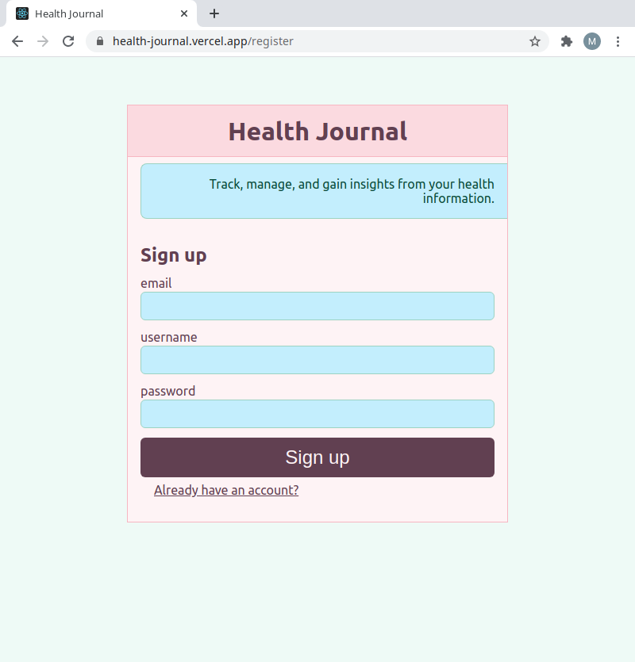

# Health Journal - RESTful API client

This is the repository for the RESTful client. To see the server code and API documentation, please visit the 
[server repository on GitHub](https://github.com/mashinke/health-journal-server).

An app to help track, manage, and gain insights from your health information.

Visit the [live app](https://health-journal.vercel.app/)

(Note: the first API call may take a while, while the server activates)

## Technology
This project was developed with [__Node.js__](https://nodejs.org/) + [__Express.js__](http://expressjs.com/) + [__Knex.js__](https://knexjs.org/) + [__Postgresql__](https://www.postgresql.org/) 
on the back end, and [__React__](https://reactjs.org/) + [__styled-components__](https://styled-components.com/) on the front end. The server is deployed on 
[Heroku](https://www.heroku.com/), and the client on [Vercel](https://vercel.com/).

## Demo account credentials: 

email: demouser@example.com
password: pass

## Screenshots

